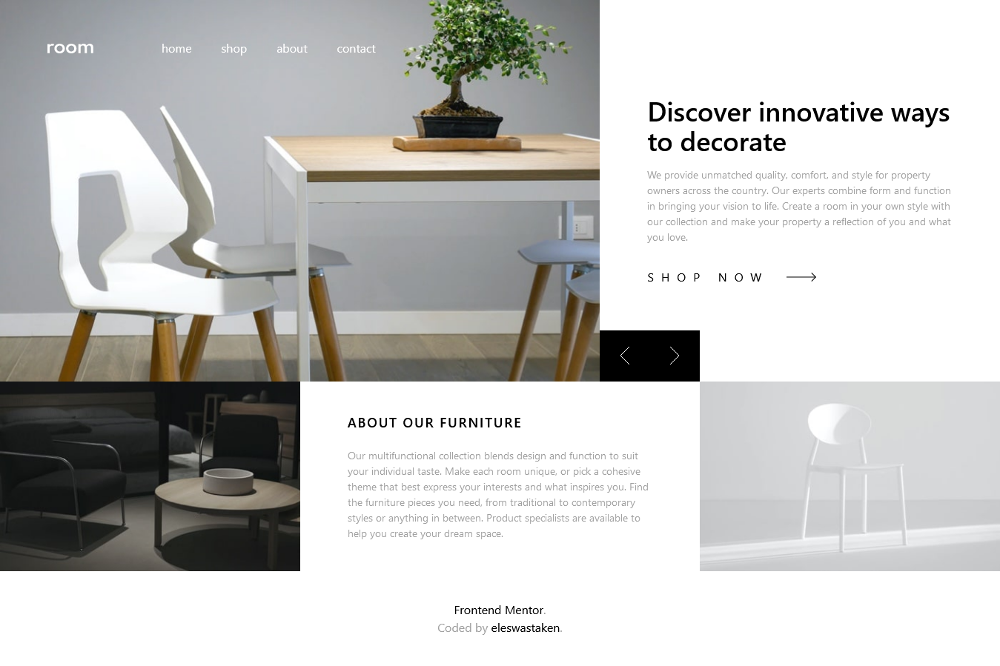

# Frontend Mentor - Room homepage 

[Room homepage](https://www.frontendmentor.io/challenges/room-homepage-BtdBY_ENq).

## The challenge

Users should be able to:

- View the optimal layout for the site depending on their device's screen size
- See hover states for all interactive elements on the page
- Navigate the slider using either their mouse/trackpad or keyboard

### Screenshots

## My process

### Built with

- Semantic HTML5 markup
- CSS custom properties
- Flexbox
- CSS Grid
- Mobile-first workflow
- Tailwind CSS

### What I learned

- Tailwind CSS - Utitility-first CSS framework. Its basics.
- Mobile first approach and which tools to use for it.
- Difference and when to use min-max media queries. Precedence of media queries.

### Continued development

Animation. Javascript Animations. Simple Animation. SVG Animations

## Author

- Frontend Mentor - [@eleswastaken](https://www.frontendmentor.io/profile/eleswastaken)
- Twitter - [@eleswastaken](https://www.twitter.com/eleswastaken)

## Acknowledgments

- Tailwind CSS
- Google
- Css-tricks
- MDN
- Stack Overflow
