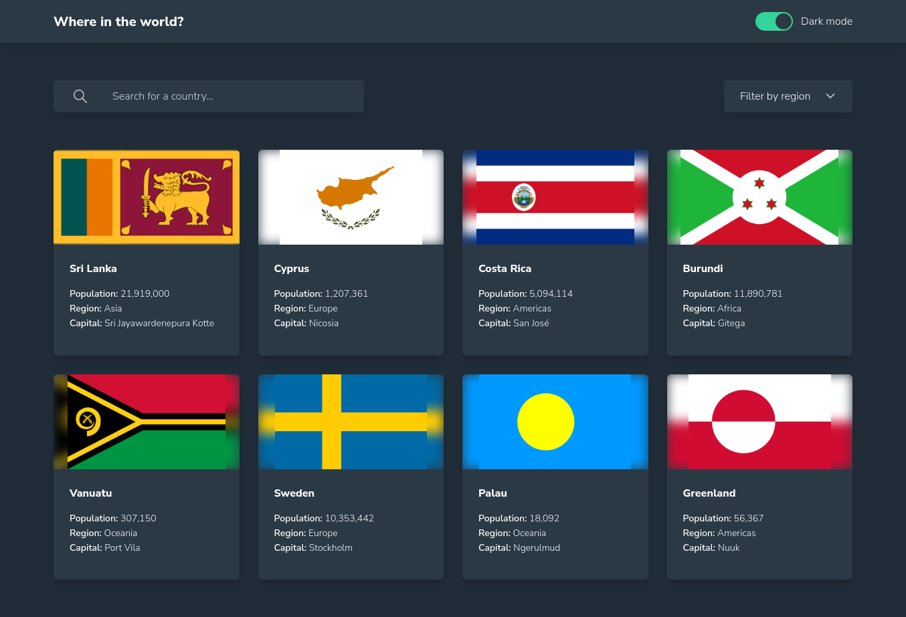
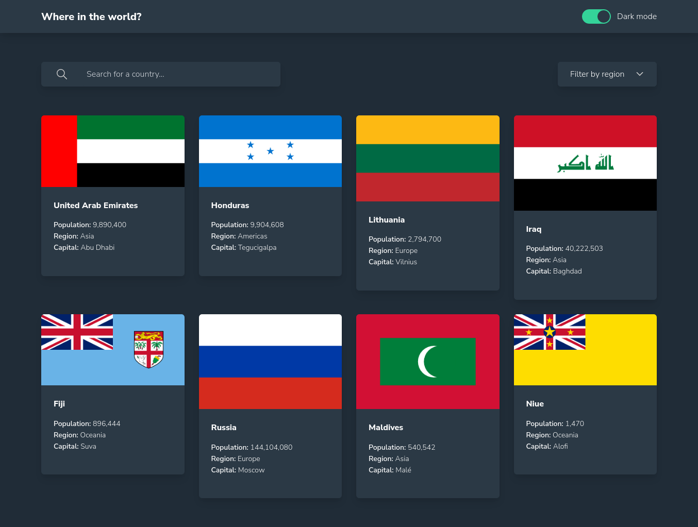

# Frontend Mentor - REST Countries API with color theme switcher 

It is [live](https://eleswastaken-front-end-countries.netlify.app/)!

## Main build: 
- Tailwind CSS
- React

### The challenge

Users should be able to:

- See all countries from the API on the homepage
- Search for a country using an `input` field
- Filter countries by region
- Click on a country to see more detailed information on a separate page
- Click through to the border countries on the detail page
- Toggle the color scheme between light and dark mode *(optional)*

### Current look

### Current problems

- When you try to apply filter, the entire page rerenders, thus removing all the changes but applying the filters. E.g. you type in the search bar, rerender, the search bar is empty but the filter has applied the first letter. Same with regions, the region filter has been applied, but the filter button value is wierd...Problem: passing props between siblings.