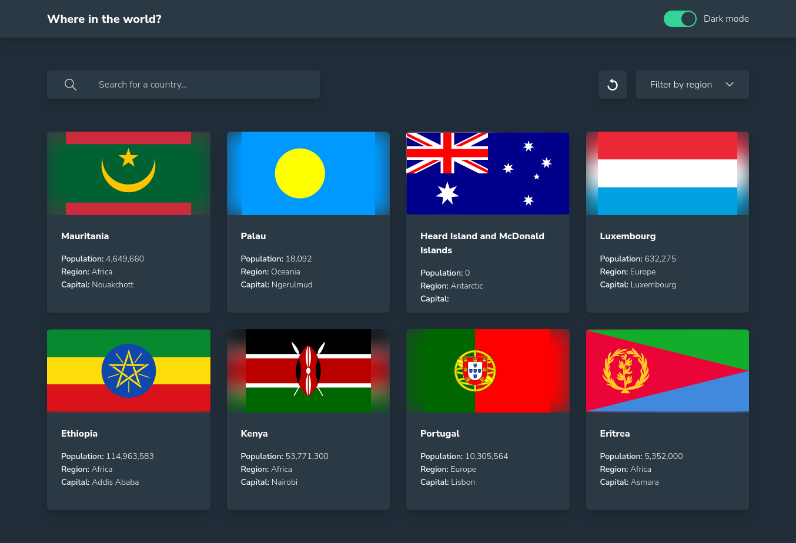

# Frontend Mentor - REST Countries API with color theme switcher 

## Links

- Live demo: [netlify](https://eleswastaken-front-end-countries-api-gui.netlify.app/)

### Main build:

- Tailwind CSS
- React JS

### Built with

- Semantic HTML5 markup
- CSS custom properties
- Flexbox
- CSS Grid
- [React](https://reactjs.org/) - JS library
- [Tailwind CSS](https://tailwindcss.com)

### The challenge

Users should be able to:

- See all countries from the API on the homepage
- Search for a country using an `input` field
- Filter countries by region
- Click on a country to see more detailed information on a separate page
- Click through to the border countries on the detail page
- Toggle the color scheme between light and dark mode *(optional)*

### Current look

### Useful resources

- [SVG repo](https://www.svgrepo.com) - Amazing collection of free svg.

## Author

- Frontend Mentor - [@eleswastaken](https://www.frontendmentor.io/profile/eleswastaken)
- GitHub - [@leswastaken](https://github.com/eleswastaken)
- Twitter - [@eleswastaken](https://www.twitter.com/eleswastaken)

### Current status

- Want to add moon and sun icons to the theme switch
- Want to add per page filter(only styling left)
