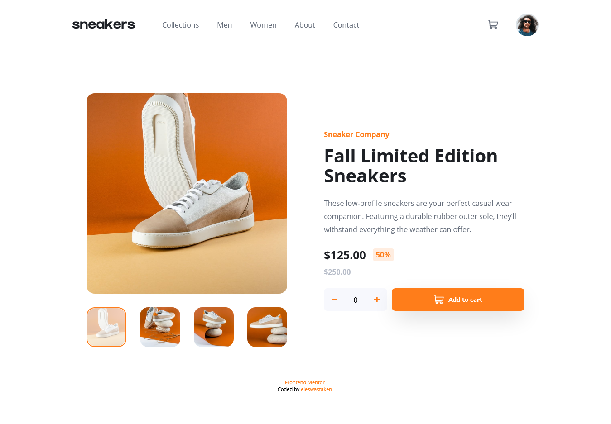
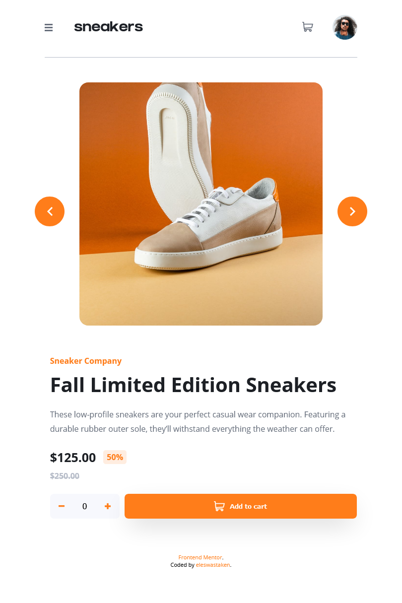
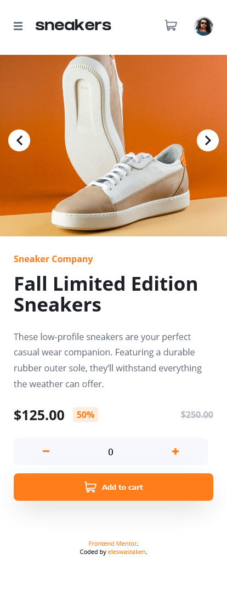

### The challenge

Users should be able to:

- View the optimal layout for the site depending on their device's screen size
- See hover states for all interactive elements on the page
- Receive an error message when the newsletter form is submitted if:
  - The input field is empty
  - The email address is not formatted correctly

### Screenshots

### Links

- Live Site URL: [GitHub Pages](https://eleswastaken.github.io/front-end-mentor/42%20E-commerce%20product%20page/)

## My process

### Built with

- Semantic HTML5 markup
- CSS custom properties
- Flexbox
- Vanilla JS

### What I learned

I've learned a lot about accessebility. I discovered tools to test it. I've learned a lot about focus flow, how to guide user to follow it, and how to structure HTML for accessebility.

## Author

- Frontend Mentor - [@eleswastaken](https://www.frontendmentor.io/profile/eleswastaken)
- Twitter - [@eleswastaken](https://www.twitter.com/eleswastaken)

## Acknowledgement
Thanks to [@frontendmentor](https://www.frontendmentor.io/)
