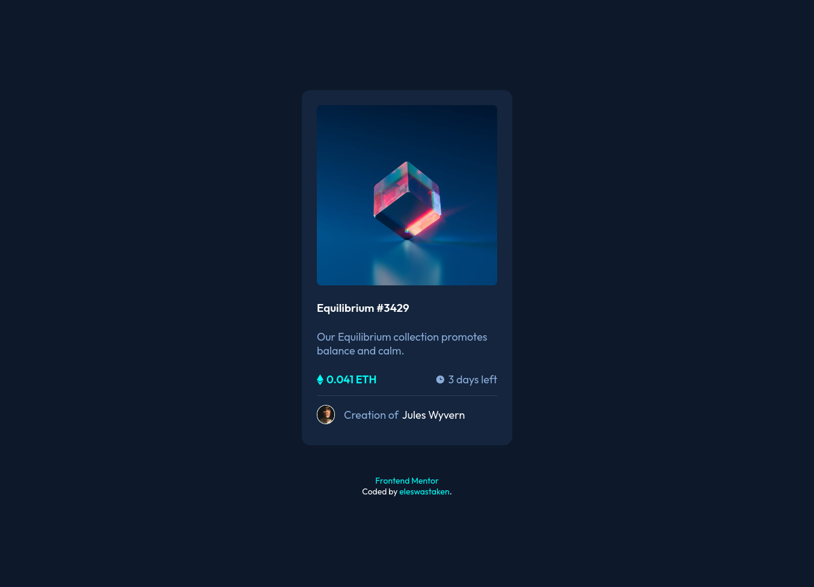

# Frontend Mentor - NFT preview card component solution

This is a solution to the [NFT preview card by Frontend Mentor](https://www.frontendmentor.io/challenges/nft-preview-card-component-SbdUL_w0U).

## Table of contents

- [Frontend Mentor - NFT preview card component solution](#frontend-mentor---nft-preview-card-component-solution)
  - [Table of contents](#table-of-contents)
  - [Overview](#overview)
    - [Screenshot](#screenshot)
    - [Links](#links)
  - [My process](#my-process)
    - [Built with](#built-with)
    - [Continued development](#continued-development)

## Overview

First, as Frontend Mentor suggested themselves, I tried structuring out markup first. Keeping in mind accessibility, and user keyboard interaction. Then came styling stage, a bit fixing markup and laying out almost everything as a flexbox item. It was a bit hard though, because a while ago I saw a someone laying out an entire page using flexbox, so I wanted to do the same. Obviously, I was really hard, eventually I just used some wrappers... :/

After that and some tweaking, I considered how exactly some users would try to interact with it, keeping in mind that it is a part of a bigger webpage. I remembered that Frontend Mentor actually turns off links on images that can be accessed with titles otherwise. So I did the same, you can still go to the card's page through both image and a title when you click, but when you use keyboard, on every card there is only two links, the others are just skipped(used tabindexes).

Added simple fading in-out transition on hover. That was not enough...

So, I figured there were two ways to tackle this challenge, first - using pseudo elements, second - changing(probably messing up) markup. I went for the first one.
If the eye svg were in the markup I would've easily change its properties using css, but in pseudo elements I didn't find a way to access it using css. So manipulating svg paths was not an option. The other idea that I've been thinking to try out was using clip-path. I tried it out, it was a good animation, but that wasn't enough either I wanted it to "blink". I remembered that you can transform elements, and you can transform them along both axis. I applied `scaleY()`, and it looked like just sliding out; added `scaleX()` too, now it looks something good enough.

The possible and probably better solution for animations would still be using some additional elements to transform in the markup... But that's for another time.

Please, Your suggestions are very welcome!

### Screenshot

### Links

- Solution URL: [here](https://github.com/eleswastaken/front-end/tree/master/43%20NFT%20Card)
- Live Page URL: [here](https://eleswastaken.github.io/front-end/43%20NFT%20Card/)
- Entire Repository live Page URL: [here](https://eleswastaken.github.io/front-end/)

## My process

### Built with

- Semantic HTML5 markup
- CSS custom properties
- SASS
- Flexbox
- Simple animation without layout shifting
- Atomic Commits

### Continued development

Yet again... animations...

Simple animations, yes, for sure. But when it comes to using classes and js to manipulate them, it feels overwhelming enough to make me dizzy.

So next challenge will be focused on that!
